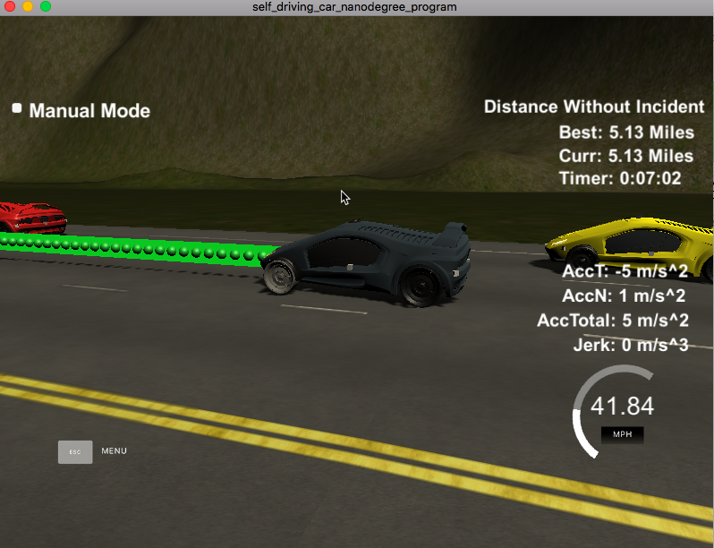

# CarND-Path-Planning-Project-P11
Udacity Self-Driving Car Nanodegree - Path Planning Project

# Overview

In this project, a path planning algorithm is implemented to drive a car on a highway. Data is provided by the Udacity simulator ([the simulator could be downloaded here](https://github.com/udacity/self-driving-car-sim/releases/tag/T3_v1.2)). The simulator sends car odometry information and sensor fusion information about the rest of the cars in the highway. It expects a set of points spaced in time at 0.02 seconds representing the car's trajectory. The communication between the simulator and the path planner is done using [WebSocket](https://en.wikipedia.org/wiki/WebSocket). The path planner uses the [uWebSockets](https://github.com/uNetworking/uWebSockets) WebSocket implementation to handle this communication. Udacity provides a seed project to start from on this project ([here](https://github.com/udacity/CarND-Path-Planning-Project)).

# Prerequisites

The project has the following dependencies (from Udacity's seed project):

- cmake >= 3.5
- make >= 4.1
- gcc/g++ >= 5.4
- libuv 1.12.0
- Udacity's simulator.


# Compiling and executing the project
The CMakeLists.txt has been copied into the src folder to generate Eclipse CDT 4.0 `.project` and `.cproject` files that can be imported in Eclipse [Eclipse IDE](ide_profiles/Eclipse/README.md).

The project could be executed directly using `./build/path_planning`

```
> cd build
> ./path_planning
Listening to port 4567
```

Now the path planner is running and listening on port 4567 for messages from the simulator. Next step is to open Udacity's simulator:


# [Rubic](https://review.udacity.com/#!/rubrics/1020/view) points

## Compilation

### The code compiles correctly.

A new file was added [src/spline.h](./scr/spline.h). It is the [Cubic Spline interpolation implementation](http://kluge.in-chemnitz.de/opensource/spline/): a single .h file you can use splines instead of polynomials. It was a great suggestion from the classroom QA video. It works great.

## Valid trajectories

### The car is able to drive at least 4.32 miles without incident.
I ran the simulator for more than 5 miles without incidents:



### The car drives according to the speed limit.
Yes

### Max Acceleration and Jerk are not Exceeded.
Yes

### Car does not have collisions.
No collisions

### The car stays in its lane, except for the time between changing lanes.
The car stays in its lane most of the time but when it changes lane because of traffic or to return to the center lane.

### The car is able to change lanes
The car change lanes when the there is a slow car in front of it, and it is safe to change lanes (no other cars around) or when it is safe to return the center lane.

## Reflection

Based on the provided code from the seed project, the path planning algorithms start at [src/main.cpp](./src/main.cpp#L250) line 250. The code could be separated into different functions and classes (OOP), but I prefer to have everything in a single place to avoid jumping to different parts of the file or other files. In a more complicated environment and different requirements, more structure could be used. 

The code consist of three parts:

### Step 1 Prediction [line 256](./src/main.cpp#L256)
This part of the code deal with the odometry and sensor fusion data. We want to know three aspects:

- Is there a car in front of us blocking the traffic.
- Is there a car to the right of us making a lane change not safe.
- Is there a car to the left of us making a lane change not safe.

These questions are answered by calculating the lane each other car is and the position it will be at the end of the last plan trajectory. 
A car is considered "dangerous" when its distance to our car is less than 30 meters in front or behind us.

### Step 2 Behavior Control [line 311](./scr/main.cpp#L311)
This part decides what to do:
  - If we have a car in front of us, do we change lanes?
  - Do we speed up or slow down?

Based on the prediction of the situation we are in, this code increases the speed, decrease speed, or make a lane change when it is safe. Instead of increasing the speed at this part of the code, a `speed_diff` is created to be used for speed changes when generating the trajectory in the last part of the code. 
This approach makes the car more responsive acting faster to changing situations like a car in front of it trying to apply breaks to cause a collision.

### Step 3 Trajectory Generation [line 354](./scr/main.cpp#L354)
This code does the calculation of the trajectory based on the speed and lane output from the behavior control, car coordinates and previous path points.
The coordinates are transformed (shift and rotation) to local car coordinates (lines 401 to 408).

In order to ensure more continuity on the trajectory (in addition to adding the last two point of the pass trajectory to the spline adjustment), the pass trajectory points are copied to the new trajectory (lines 414 to 420). 
The rest of the points are calculated by evaluating the spline and transforming the output coordinates to not local coordinates. 
